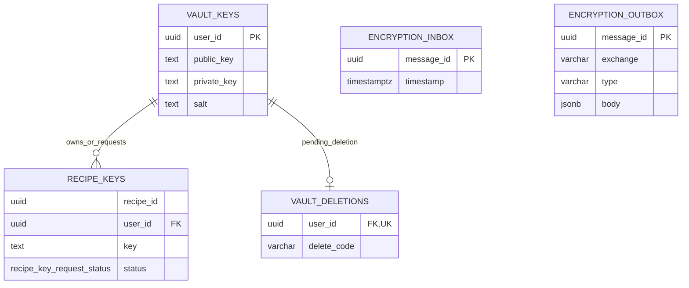

# ChefBook Backend Encryption Service

The encryption service owns encrypted vault metadata, encrypted recipe keys, key access requests, vault deletion codes, and encryption-related MQ events.

## Responsibilities

- Store encrypted vault public/private key metadata.
- Store encrypted recipe keys per user.
- Track recipe key access request status.
- Manage vault deletion request and confirmation.
- Coordinate encrypted recipe access with recipe/profile/auth services.

## Main RPC Families

- `HasEncryptedVault`
- `GetEncryptedVaultKey`
- `CreateEncryptedVault`
- `RequestEncryptedVaultDeletion`
- `DeleteEncryptedVault`
- `GetRecipeKeyRequests`
- `RequestRecipeKeyAccess`
- `GetRecipeKey`
- `SetRecipeKey`
- `DeleteRecipeKey`

## Dependencies

- Calls `auth` for identity/account information.
- Calls `profile` for profile read data.
- Calls `recipe` for recipe policy and recipe metadata.
- Publishes and consumes MQ messages when configured.
- Owns its PostgreSQL schema and migrations.

## Database Ownership

Owns:

- `vault_keys` - encrypted vault public key, encrypted private key, and salt.
- `recipe_keys` - encrypted recipe keys and key request status.
- `vault_deletions` - pending deletion codes.
- `inbox` and `outbox` - MQ idempotency and outgoing events.

Important constraints:

- `recipe_keys` are unique by recipe and user.
- `recipe_keys.recipe_id` is a logical reference to `recipe`.
- `recipe_keys.user_id` is local to vault ownership, not a database FK to auth/user.

## Encryption Process

ChefBook encrypted recipes can still be shared. The client owns plaintext keys; the backend stores encrypted key material.

### Vault

1. When a user creates an encrypted vault, the client generates an RSA keypair.
2. To synchronize data between devices, the user stores vault keys remotely.
3. The client derives an AES key from the user's passphrase.
4. The RSA private key is encrypted with AES and uploaded to the server.

### Recipe

1. For every encrypted recipe, the client generates a random AES key.
2. The recipe AES key is encrypted with the vault RSA public key and uploaded to the server.

The user's passphrase is the first link in the chain. Each link can be changed independently, which keeps sharing flexible.

## Diagrams

    

    

